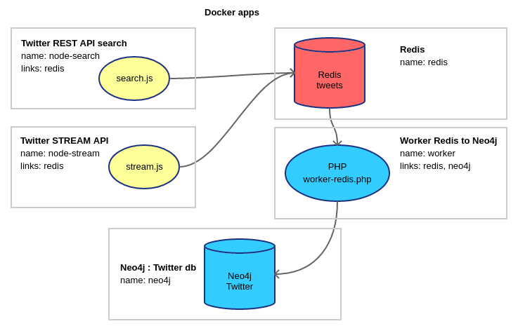

### DB Tweets

Or how to vacuum a lot of tweets on a specific topic.

It uses both Twitter SEARCH (recursive intervals) and STREAM API.
Tweets are finally inserted into a Neo4j database that you can query in real time.

Please, read and agree the [Twitter Developer Agreement and Policy](https://developer.twitter.com/en/developer-terms/agreement-and-policy.html)



### Requirement

- [Docker](https://docs.docker.com/install/)
- [Docker Compose](https://docs.docker.com/compose/)

### Install

```
git clone https://github.com/Tazeg/dbtweets.git
cd dbtweets
```

- Create a local directory for the Neo4j database :

```
mkdir /home/user/neo4j
```

- Rename `docker/twitter/src/.env.sample` to `.env` and edit it.
- Update the Neo4j volume path in `docker-compose.yml` according to the directory you created on the previous command


### Run

```
docker-compose rm
docker-compose build
docker-compose up
(or "docker-compose up -d" for daemon mode)
```

Go to :

- http://localhost:7474 for direct access to the Database (login/pass : neo4j/123456)

### Sample Neo4j queries

You just have to copy/paste into the Neo4j dashboard :

How many users in database :
```
MATCH (n:User) RETURN COUNT(n)
```

How many tweets :
```
MATCH (n:Tweet) RETURN COUNT(n)
```

Tweets count by date :
```
MATCH (t:Tweet)
RETURN t.created_at_YMD, count(*) AS nb
ORDER BY t.created_at_YMD
```

App used to post tweets :
```
MATCH (u:User)-[:POSTS|RETWEETS]->(t:Tweet) 
WITH COUNT(t.source) AS nb, t.source AS source 
RETURN source, nb ORDER By nb DESC LIMIT 8
```

Tweets having coordinates :
```
MATCH (u:User)-[:POSTS]->(t:Tweet) 
WHERE t.latitude<>0 AND t.longitude<>0 
RETURN u,t
```

Searching strings in tweets :
```
MATCH (u:User)-[]->(t:Tweet) 
WHERE toLower(t.text) CONTAINS 'car'
RETURN t.created_at_YMD, t.created_at_HIS, u.screen_name,t.text
ORDER BY t.created_at_YMD DESC, t.created_at_HIS DESC
LIMIT 20
```

Hashtags and counts :
```
MATCH (h:Hashtag)<-[:TAGS]-(t:Tweet) 
WITH h, COUNT(h) AS nb
ORDER BY nb DESC
RETURN h.text AS text, nb 
LIMIT 15
```

Most shared links :
```
MATCH (t:Tweet)-[r:CONTAINS]->(l:Link) 
WITH l.url AS url,COUNT(r) AS nb 
WHERE nb>1 
RETURN url,nb 
ORDER BY nb DESC
```

Most shared medias :
```
MATCH (t:Tweet) 
WHERE t.media_url<>"" 
RETURN t.media_url AS media, COUNT(t.media_url) AS nb 
ORDER BY nb DESC
```

Most retweeted tweets :
```
MATCH (u:User)-[:POSTS]->(t:Tweet) 
RETURN 'https://twitter.com/' + u.screen_name + '/status/' + t.id_str AS tweeturl,t.text,t.retweet_count
ORDER BY t.retweet_count DESC LIMIT 100
```

Top languages of tweets :
```
MATCH (t:Tweet) 
WHERE t.lang<>"und" 
RETURN t.lang AS lng, COUNT(t.lang) AS nb 
LIMIT 10
```

Most active users :
```
MATCH (u:User)-[r:POSTS|RETWEETS]->(t:Tweet)
RETURN u.screen_name AS screen_name,
       COUNT(r) AS tweet_or_rt_count,
       u.friends_count AS friends_count,
       u.followers_count AS followers_count
ORDER BY tweet_or_rt_count DESC
LIMIT 15
```

Most mentionned users :
```
MATCH (t:Tweet)-[:MENTIONS]->(u:User)
WHERE NOT t.text=~("(?i)^RT @"+u.screen_name+".*")
RETURN  u.screen_name AS screen_name,
        COUNT(u.screen_name) AS count,
        u.friends_count AS friends_count,
        u.followers_count AS followers_count
ORDER BY count DESC
LIMIT 15
```

Users who RT the most :
```
MATCH (u:User)-[r:RETWEETS]->(t:Tweet)
RETURN u.screen_name AS screen_name,
       COUNT(r) AS nbRT
ORDER BY nbRT DESC       
LIMIT 15
```

List of RT from a given user sorted by date :
```
MATCH (u1:User)-[r:RETWEETS]->(t:Tweet)<-[:POSTS]-(u2:User)
WHERE u1.id_str='123456789' 
RETURN t.created_at_YMD + ' ' + t.created_at_HIS AS dateTweet, r.created_at_YMD + ' ' + r.created_at_HIS AS dateRT, u2.screen_name, t.text
ORDER BY t.created_at_YMD DESC, t.created_at_HIS DESC
LIMIT 15
```

List of the very first retweeters of a given tweet :
```
MATCH (u:User)-[r:RETWEETS]->(t:Tweet {id_str: '123456789'})
RETURN t.created_at_YMD + ' ' + t.created_at_HIS AS dateTweet, r.created_at_YMD + ' ' + r.created_at_HIS AS dateRT,
	duration.between(datetime(t.created_at_YMD + 'T' + t.created_at_HIS), datetime(r.created_at_YMD + 'T' + r.created_at_HIS)).seconds AS seconds,
	u.screen_name AS retweeter
ORDER BY seconds
LIMIT 15
```

### Stop

```
CTRL+C
(or "docker-compose stop" if daemon)
```

### Donate

https://en.jeffprod.com/donate/
